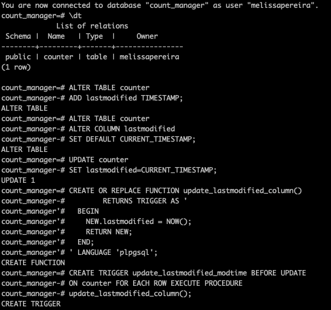

# Description
This is a counter web app built in Ruby using Sinatra and Capybara. This app uses PostgreSQL to store the count.

# Setting up the database
1. Connect to `psql`
2. Create the production and test databases using the psql commands `CREATE DATABASE count_manager;` and `CREATE DATABASE count_manager_test;`
3. Connect to the production database using the pqsl command `\c count_manager;`
4. Run the queries saved in the file `01_create_counter_table.sql`
5. Repeat steps 3 and 4 for the test database.

# How to run the app
1. Clone this repository
2. `cd` into the cloned directory
3. Run `bundle` to install dependencies
4. Run `rackup`
5. Navigate to `http://localhost:9292/` in your browser

# How to run the tests
1. Clone this repository
2. `cd` into the cloned directory
3. Run `bundle` to install dependencies
4. Run `rspec`

# Questions to explore
* What is the difference in behaviour between this app and one which there is [no database](https://github.com/tatsiana-makers/count-sinatra)?
* Which of the MVC components interacts with the database?
* What parts of the code run when we run the app in our browser? You could test your assumption by adding `p` lines and checking that you see the output you expect.
* What part of the code runs when we click the "Increment" button?
* Can you add a "Decrement" button which decreases the count by 1 each time it is pressed?
* Can you update the app to display the time that the count was last updated? This value should be stored in the database so that it will be accurately displayed even if the server is restarted.

# Added a decrement button

In feature and unit spec:
```ruby
describe '#decrement' do
it 'decreases the count by 1' do
  counter = Counter.new
  counter.decrement
  expect(counter.count).to eq -1
end
end

feature "decreases the count" do
  scenario "click the Decrement button and see the number decrease" do
    visit("/")
    expect(page).to have_content 0
    click_button "Decrement"
    expect(page).to have_button('Decrement')
    expect(page).to have_content -1
  end
end

```

In controller:
```ruby
post '/decrement' do
  @counter.decrement
  redirect '/'
end
```
In view:
```ruby
<form action="/decrement" method="post">
  <input type="submit" value="Decrement">
</form>
```
In model:
```ruby
def decrement
  read_count = count
  result = DatabaseConnection.query("UPDATE counter SET count = '#{read_count - 1}' WHERE id=1;")
end
```

# Added the time that the count was last updated
Note: Still working on the unit and feature test for this.

In view:
```ruby
  <div id="time">Counter last updated:<%= @counter.time %></div>
```
In model:
```ruby
def time
  newtime = DatabaseConnection.query("SELECT * FROM counter WHERE id=1;")
  newtime[0]['lastmodified'].to_s
end
```
In psql:

ALM shared this [link](http://pointbeing.net/weblog/2008/03/mysql-versus-postgresql-adding-a-last-modified-column-to-a-table.html) and talked us through it. Thanks ALM!


# Some CSS

